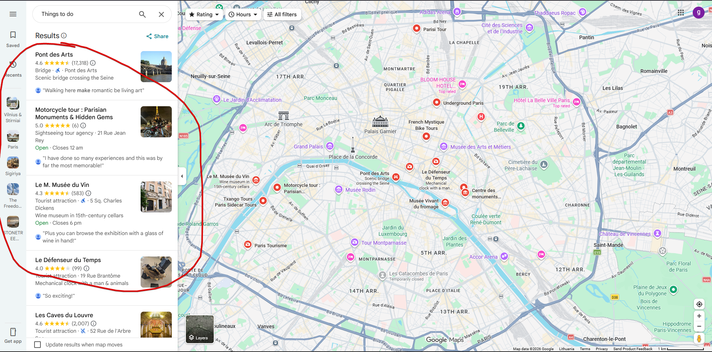
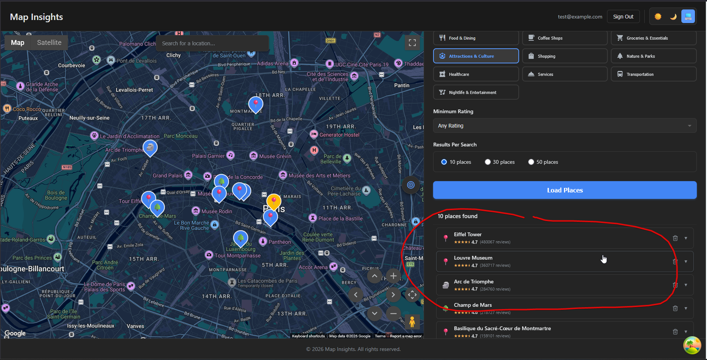

# Map Insights

A full-stack application for better travel planning with enhanced location discovery. Built as a demo project using AI-assisted development (GitHub Copilot).

## What It Does

The official Google Maps app often misses important landmarks in search results—for example, the Eiffel Tower may not appear when searching "things to do" in Paris. 

**Map Insights solves this** by querying the most-reviewed places within the current map viewport and displaying them as a prioritized list with map markers.

  


## Technologies

**Backend**: .NET 10 Minimal API, GoogleApi (Places/Maps), xUnit  
**Frontend**: React 19 + TypeScript, Vite, @vis.gl/react-google-maps, TanStack Router/Query, Zustand  
**Testing**: Vitest, Playwright (E2E)  
**Auth**: Firebase Authentication

---

## How to Run

### Prerequisites
- .NET 10 SDK
- Node.js 18+
- Google Maps API keys (ask the author for dev credentials)

### Setup
1. **Get credentials** from the author:
   - `src/frontend/.env.local` (Google Maps JavaScript API key)
   - `src/backend/src/MapInsights.Api/appsettings.Development.json` (Google Maps API key)

2. **Install frontend dependencies**:
   ```bash
   cd src/frontend
   npm install
   ```

### Run the Application
1. **Start backend** (runs on http://localhost:5000):
   ```bash
   cd src/backend/src/MapInsights.Api
   dotnet run
   ```

2. **Start frontend** (runs on http://localhost:3000):
   ```bash
   cd src/frontend
   npm
   ```

3. Open http://localhost:3000 in your browser

4. **Sign in with test user**:
   - Email: `test@example.com`
   - Password: `Test123456!`

## Notes & Tools

- **AI-Generated**: 99.9% of code generated with GitHub Copilot
- **Models Used**:
  - Claude Sonnet 4.5 (heavy tasks)
  - Claude Haiku 4.5 (light tasks)
- **References**:
  - https://claude.ai/ for generating initial `./instructions`
  - https://github.com/Wirasm/PRPs-agentic-eng (appeared too heavy and verbose; opted for Plan + Agentic flow instead)
  - https://github.com/microsoft/playwright-cli (excellent for UI E2E testing)

### Feature Implementation Flow

Optional steps (except where noted as required):
1. Consult ChatGPT or Claude.ai for guidelines and architecture overview
2. Plan agent: Create initial plan based on high-level feature requirements
3. Refine plan if needed
4. **[Required]** Delegate to agent for implementation including tests and checks
5. E2E testing using Playwright
6. Manual testing  

## Observations & Learnings

- **Prior investigation & consultation**: Using ChatGPT or Claude.ai to explore guidelines and architecture before implementation yields better results
- **Plan review**: Plans created by the agent should be reviewed and refined by humans
- **Precise prompts**: More specific prompts produce more accurate implementations
- **Instructions-first approach**: Starting with proper instructions and updating them iteratively is more efficient than ad-hoc prompting
- **Agent reflection**: Asking agents to reflect on sessions and update instructions helps improve future results
- **Skills over MCP servers**: Skills are more powerful; in most cases, MCP servers can be replaced with proper skills or simple CLI utilities (e.g., prefer `gh` CLI over GitHub MCP)
- **Focused tools**: During this project, only one skill (playwright-cli) was needed for automating testing

### Customer Project Learnings (not used in the current project)

- **Custom prompts are underestimated**: Many routine tasks can be automated with custom prompts (e.g., starting work on a Jira ticket, preparing PRs for review, generating release notes, creating documentation from code changes)
- **Custom skills for domain expertise**: Skills can teach agents to work with customer-specific resources, services, and infrastructure (e.g., AWS SSO authentication, log search and analysis, deployment workflows, internal API interactions)
- **Specialized agents for non-coding tasks**: Specialized agents are powerful for specific domains, but general coding agents suffice for development work. Best use cases: documentation writing agents, web research agents, domain-specific analysis agents (e.g., security audits, performance analysis)

### Additional Notes / Personal Impressions

- **Demo vs. real projects**: The approach and workflow used in this demo project differs from real-world enterprise development
- **"Vibe-code an app" limitations**: Building an app through high-level prompts works for demos, but real project development workflows require more structure and rigor
- **Granularity matters**: Production features are typically more granular with stricter quality requirements, detailed specifications, and comprehensive edge case handling

## Development Workflow

### Session 1: Instructions & Project Setup

See [session1-instructions-project-setup.prompts.md](.github/prompts/session1-instructions-project-setup.prompts.md)

### Session 2: Frontend Configuration

See [session2-frontend-configuration.prompts.md](.github/prompts/session2-frontend-configuration.prompts.md)

### Session 3: Map Implementation

See [session3-map-implementation.prompts.md](.github/prompts/session3-map-implementation.prompts.md)

### Other Sessions

See [pattern-plan-implement.prompts.md](.github/prompts/pattern-plan-implement.prompts.md)

### Plan files

Some implementation plan files can be found in the [.github/prompts/](.github/prompts/) dir

### E2E tests

Test scenarios and reports [tests/e2e](tests/e2e)